# Boston Hospital Database System
**Database Design and Implementation Report**

---

## Executive Summary

This coursework project documents the design, relational schema, and implementation of a database system for Boston Hospital using MySQL 8.0. The system replaces legacy paper records with a relational model covering 17 hospital departments, 240 inpatient beds, and an outpatient clinic. 

The implementation models key hospital workflows, including staff rotas, patient referrals and admissions, ward bed allocations, medication prescriptions, and central store inventory requisitions. All 14 transaction requirements (a through n) are supported via stored procedures and reporting views to ensure transactional consistency and referential integrity.

---

## Contents
1. [Part A: Database Description](#part-a-database-description)
2. [Part B: Entity Relationship Diagram (ERD)](#part-b-entity-relationship-diagram-erd)
3. [Part C: Relational Schema & Functional Dependencies](#part-c-relational-schema--functional-dependencies)
4. [Part D: Database and Table Creation (DDL & Sample Data)](#part-d-database-and-table-creation)
5. [Part E: Views, Stored Procedures & Validation (Transactions a–n)](#part-e-views-stored-procedures--validation)

---

# Part A: Database Description

### 1. System Overview
Boston Hospital is a specialized healthcare facility primarily caring for elderly patients across 17 wards and departments (such as Orthopaedic, Cardiology, and Geriatrics), with an overall capacity of 240 inpatient beds. It also operates an outpatient clinic.

The primary goal of this database is to provide structured storage for clinical and administrative operations, eliminating data redundancy and ensuring that records such as patient histories, bed allocations, and prescription logs are readily accessible to authorized staff.

### 2. Database System Selection
We implemented the system using **MySQL 8.0** with the default **InnoDB** storage engine. Key technical factors influencing this choice include:
* **Referential Integrity:** InnoDB enforces foreign key constraints with cascade options (`ON UPDATE CASCADE`, `ON DELETE RESTRICT`, `ON DELETE SET NULL`), preventing orphaned records.
* **ACID Transactions:** Full support for atomic operations and row-level locking ensures safe concurrent updates during bed allocations and inventory requisitions.
* **Views and Stored Procedures:** Encapsulates business logic within the database tier, ensuring consistency regardless of the client interface used.

### 3. Core Entities and Business Rules
1. **Departments:** Identifies the hospital's operational units with allocated bed quotas, block locations, telephone extensions, and designated Charge Nurses.
2. **Staff & Employment:** Tracks personnel across clinical and administrative tiers (Medical Director, HR Director, Charge Nurses, Consultants, Staff Nurses). Includes qualifications, previous work experience, and contract details (hours per week, payment terms).
3. **Department Rosters:** Records weekly shift schedules (Early, Late, Night) set up by Charge Nurses to ensure round-the-clock ward coverage.
4. **Local Doctors & Patients:** Records referring general practitioners and registered patient demographics, including emergency next-of-kin contacts.
5. **Appointments & Triage:** Consultant examinations triage patients to either outpatient clinic visits or the inpatient department waiting list.
6. **Inpatient Ward Management:** Tracks patient admission lifecycles: placement on a waiting list, bed allocation within a ward, expected discharge dates, and actual departure dates.
7. **Supplies & Inventory:**
   * *Pharmaceutical Supplies:* Tracks drug names, descriptions, dosages, administration routes, stock balances, reorder levels, and unit costs.
   * *Surgical Supplies:* Tracks consumable equipment (syringes, gauze, aprons, waste bags).
8. **Patient Medications:** Logs prescriptions issued to patients, recording dosage units, administration methods, and start/finish dates.
9. **Department Requisitions:** Facilitates internal ordering of supplies from the central hospital store, authenticated by staff and signed off upon receipt.

### 4. Key Design Considerations
* **Lifecycle State Tracking:** Patients progress through several states: Outpatient Referral ➔ Waiting List ➔ Admitted (assigned a specific bed) ➔ Discharged. Inpatient bed allocation queries check that beds are not double-booked for overlapping date ranges.
* **Inventory Separation:** Pharmaceutical items require specific clinical attributes (dosage and administration route), whereas surgical items are tracked as general physical consumables. Both feed into a unified requisition table for store dispensing.
* **Role-Based Workflows:** Stored procedures align with hospital roles: HR procedures manage staff and contracts; Charge Nurse procedures manage ward admissions, rotas, and prescriptions; Medical Director procedures manage suppliers and hospital-wide stock.

---

# Part B: Entity Relationship Diagram (ERD)

The diagram below defines all entities, primary keys (`PK`), foreign keys (`FK`), and Crow's Foot cardinalities.

```mermaid
erDiagram
    DEPARTMENTS ||--o{ STAFF : "employs"
    DEPARTMENTS ||--o{ DEPARTMENT_STAFF_ROSTER : "schedules"
    DEPARTMENTS ||--o{ INPATIENT_STAYS : "admits"
    DEPARTMENTS ||--o{ DEPARTMENT_REQUISITIONS : "orders"
    
    STAFF ||--o{ STAFF_QUALIFICATIONS : "holds"
    STAFF ||--o{ STAFF_EXPERIENCE : "possesses"
    STAFF ||--|| STAFF_CONTRACTS : "governed_by"
    STAFF ||--o{ DEPARTMENT_STAFF_ROSTER : "assigned_to"
    STAFF ||--o{ APPOINTMENTS : "conducts"
    STAFF ||--o{ OUTPATIENT_APPOINTMENTS : "supervises"
    STAFF ||--o{ DEPARTMENT_REQUISITIONS : "requisitions"
    
    LOCAL_DOCTORS ||--o{ PATIENTS : "refers"
    
    PATIENTS ||--o{ APPOINTMENTS : "attends"
    PATIENTS ||--o{ OUTPATIENT_APPOINTMENTS : "scheduled_for"
    PATIENTS ||--o{ INPATIENT_STAYS : "admitted_as"
    PATIENTS ||--o{ PATIENT_MEDICATIONS : "prescribed"
    
    SUPPLIERS ||--o{ PHARMACEUTICAL_SUPPLIES : "supplies"
    SUPPLIERS ||--o{ SURGICAL_SUPPLIES : "supplies"
    
    PHARMACEUTICAL_SUPPLIES ||--o{ PATIENT_MEDICATIONS : "dispensed_in"
    PHARMACEUTICAL_SUPPLIES ||--o{ DEPARTMENT_REQUISITIONS : "ordered_in"
    SURGICAL_SUPPLIES ||--o{ DEPARTMENT_REQUISITIONS : "ordered_in"

    DEPARTMENTS {
        int DepartmentNumber PK
        string DepartmentName
        string Location
        int TotalBeds
        string TelephoneExtension
    }

    STAFF {
        string StaffNumber PK
        string FirstName
        string LastName
        string Address
        string TelephoneNumber
        date DateOfBirth
        enum Gender
        string NINumber UK
        string Position
        decimal CurrentSalary
        string SalaryScale
        int DepartmentNumber FK
    }

    STAFF_CONTRACTS {
        int ContractID PK
        string StaffNumber FK
        decimal HoursPerWeek
        enum ContractType
        enum PaymentType
        date StartDate
    }

    STAFF_QUALIFICATIONS {
        int QualificationID PK
        string StaffNumber FK
        string QualificationType
        date QualificationDate
        string InstitutionName
    }

    STAFF_EXPERIENCE {
        int ExperienceID PK
        string StaffNumber FK
        string OrganizationName
        string Position
        date StartDate
        date FinishDate
    }

    DEPARTMENT_STAFF_ROSTER {
        int RosterID PK
        int DepartmentNumber FK
        string StaffNumber FK
        date WeekBeginning
        enum Shift
    }

    LOCAL_DOCTORS {
        int DoctorID PK
        string FullName
        string ClinicNumber UK
        string Address
        string TelephoneNumber
    }

    PATIENTS {
        string PatientNumber PK
        string FirstName
        string LastName
        string Address
        string TelephoneNumber
        date DateOfBirth
        enum Gender
        enum MaritalStatus
        date DateRegistered
        string NOK_FullName
        string NOK_Relationship
        string NOK_Address
        string NOK_TelephoneNumber
        int DoctorID FK
    }

    APPOINTMENTS {
        int AppointmentNumber PK
        string PatientNumber FK
        string ConsultantStaffNumber FK
        date AppointmentDate
        time AppointmentTime
        string ExaminationRoom
        enum Recommendation
    }

    OUTPATIENT_APPOINTMENTS {
        int OutpatientID PK
        string PatientNumber FK
        date AppointmentDate
        time AppointmentTime
        string ClinicRoom
        string ChargeNurseStaffNumber FK
    }

    INPATIENT_STAYS {
        int InpatientStayID PK
        string PatientNumber FK
        int DepartmentNumber FK
        date DateOnWaitingList
        int ExpectedStayDays
        date DatePlaced
        date ExpectedLeaveDate
        date ActualLeaveDate
        int BedNumber
    }

    SUPPLIERS {
        int SupplierNumber PK
        string SupplierName
        string Address
        string Email
        string TelephoneNumber
        string FaxNumber
    }

    PHARMACEUTICAL_SUPPLIES {
        int DrugNumber PK
        string Name
        string Description
        string Dosage
        string MethodOfAdmin
        int QuantityInStock
        int ReorderLevel
        decimal CostPerUnit
        int SupplierNumber FK
    }

    SURGICAL_SUPPLIES {
        int ItemNumber PK
        string ItemName
        enum ItemType
        string Description
        int QuantityInStock
        int ReorderLevel
        decimal CostPerUnit
        int SupplierNumber FK
    }

    PATIENT_MEDICATIONS {
        int MedicationID PK
        string PatientNumber FK
        int DrugNumber FK
        int UnitsPerDay
        string MethodOfAdmin
        date StartDate
        date FinishDate
    }

    DEPARTMENT_REQUISITIONS {
        string RequisitionNumber PK
        int DepartmentNumber FK
        string StaffNumber FK
        date RequisitionDate
        enum SupplyType
        int DrugNumber FK
        int ItemNumber FK
        string ItemName
        string Description
        string Dosage
        string MethodOfAdmin
        decimal CostPerUnit
        int QuantityRequired
        string ReceivedByStaffNumber FK
        date DateReceived
    }
```



---

# Part C: Relational Schema & Functional Dependencies

## 1. Relational Schema
* **Departments** (**<u>DepartmentNumber</u>**, DepartmentName, Location, TotalBeds, TelephoneExtension)
* **Staff** (**<u>StaffNumber</u>**, FirstName, LastName, Address, TelephoneNumber, DateOfBirth, Gender, NINumber, Position, CurrentSalary, SalaryScale, *DepartmentNumber*)
  * *Foreign Key:* `DepartmentNumber` references `Departments(DepartmentNumber)`
* **StaffContracts** (**<u>ContractID</u>**, *StaffNumber*, HoursPerWeek, ContractType, PaymentType, StartDate)
  * *Foreign Key:* `StaffNumber` references `Staff(StaffNumber)`
* **StaffQualifications** (**<u>QualificationID</u>**, *StaffNumber*, QualificationType, QualificationDate, InstitutionName)
  * *Foreign Key:* `StaffNumber` references `Staff(StaffNumber)`
* **StaffExperience** (**<u>ExperienceID</u>**, *StaffNumber*, OrganizationName, Position, StartDate, FinishDate)
  * *Foreign Key:* `StaffNumber` references `Staff(StaffNumber)`
* **DepartmentStaffRoster** (**<u>RosterID</u>**, *DepartmentNumber*, *StaffNumber*, WeekBeginning, Shift)
  * *Foreign Keys:* `DepartmentNumber` references `Departments(DepartmentNumber)`, `StaffNumber` references `Staff(StaffNumber)`
* **LocalDoctors** (**<u>DoctorID</u>**, FullName, ClinicNumber, Address, TelephoneNumber)
* **Patients** (**<u>PatientNumber</u>**, FirstName, LastName, Address, TelephoneNumber, DateOfBirth, Gender, MaritalStatus, DateRegistered, NOK_FullName, NOK_Relationship, NOK_Address, NOK_TelephoneNumber, *DoctorID*)
  * *Foreign Key:* `DoctorID` references `LocalDoctors(DoctorID)`
* **Appointments** (**<u>AppointmentNumber</u>**, *PatientNumber*, *ConsultantStaffNumber*, AppointmentDate, AppointmentTime, ExaminationRoom, Recommendation)
  * *Foreign Keys:* `PatientNumber` references `Patients(PatientNumber)`, `ConsultantStaffNumber` references `Staff(StaffNumber)`
* **OutpatientAppointments** (**<u>OutpatientID</u>**, *PatientNumber*, AppointmentDate, AppointmentTime, ClinicRoom, *ChargeNurseStaffNumber*)
  * *Foreign Keys:* `PatientNumber` references `Patients(PatientNumber)`, `ChargeNurseStaffNumber` references `Staff(StaffNumber)`
* **InpatientStays** (**<u>InpatientStayID</u>**, *PatientNumber*, *DepartmentNumber*, DateOnWaitingList, ExpectedStayDays, DatePlaced, ExpectedLeaveDate, ActualLeaveDate, BedNumber)
  * *Foreign Keys:* `PatientNumber` references `Patients(PatientNumber)`, `DepartmentNumber` references `Departments(DepartmentNumber)`
* **Suppliers** (**<u>SupplierNumber</u>**, SupplierName, Address, Email, TelephoneNumber, FaxNumber)
* **PharmaceuticalSupplies** (**<u>DrugNumber</u>**, Name, Description, Dosage, MethodOfAdmin, QuantityInStock, ReorderLevel, CostPerUnit, *SupplierNumber*)
  * *Foreign Key:* `SupplierNumber` references `Suppliers(SupplierNumber)`
* **SurgicalSupplies** (**<u>ItemNumber</u>**, ItemName, ItemType, Description, QuantityInStock, ReorderLevel, CostPerUnit, *SupplierNumber*)
  * *Foreign Key:* `SupplierNumber` references `Suppliers(SupplierNumber)`
* **PatientMedications** (**<u>MedicationID</u>**, *PatientNumber*, *DrugNumber*, UnitsPerDay, MethodOfAdmin, StartDate, FinishDate)
  * *Foreign Keys:* `PatientNumber` references `Patients(PatientNumber)`, `DrugNumber` references `PharmaceuticalSupplies(DrugNumber)`
* **DepartmentRequisitions** (**<u>RequisitionNumber</u>**, *DepartmentNumber*, *StaffNumber*, RequisitionDate, SupplyType, *DrugNumber*, *ItemNumber*, ItemName, Description, Dosage, MethodOfAdmin, CostPerUnit, QuantityRequired, *ReceivedByStaffNumber*, DateReceived)
  * *Foreign Keys:* `DepartmentNumber` references `Departments(DepartmentNumber)`, `StaffNumber` references `Staff(StaffNumber)`, `DrugNumber` references `PharmaceuticalSupplies(DrugNumber)`, `ItemNumber` references `SurgicalSupplies(ItemNumber)`, `ReceivedByStaffNumber` references `Staff(StaffNumber)`

---

## 2. Functional Dependencies & Normalization

### Functional Dependencies
1. **Departments:**
   `DepartmentNumber → DepartmentName, Location, TotalBeds, TelephoneExtension`
2. **Staff:**
   `StaffNumber → FirstName, LastName, Address, TelephoneNumber, DateOfBirth, Gender, NINumber, Position, CurrentSalary, SalaryScale, DepartmentNumber`  
   `NINumber → StaffNumber` *(Candidate Key)*
3. **StaffContracts:**
   `ContractID → StaffNumber, HoursPerWeek, ContractType, PaymentType, StartDate`  
   `StaffNumber → ContractID, HoursPerWeek, ContractType, PaymentType, StartDate`
4. **StaffQualifications:**
   `QualificationID → StaffNumber, QualificationType, QualificationDate, InstitutionName`
5. **StaffExperience:**
   `ExperienceID → StaffNumber, OrganizationName, Position, StartDate, FinishDate`
6. **DepartmentStaffRoster:**
   `RosterID → DepartmentNumber, StaffNumber, WeekBeginning, Shift`  
   `(StaffNumber, WeekBeginning) → DepartmentNumber, Shift`
7. **LocalDoctors:**
   `DoctorID → FullName, ClinicNumber, Address, TelephoneNumber`  
   `ClinicNumber → DoctorID, FullName, Address, TelephoneNumber` *(Candidate Key)*
8. **Patients:**
   `PatientNumber → FirstName, LastName, Address, TelephoneNumber, DateOfBirth, Gender, MaritalStatus, DateRegistered, NOK_FullName, NOK_Relationship, NOK_Address, NOK_TelephoneNumber, DoctorID`
9. **Appointments:**
   `AppointmentNumber → PatientNumber, ConsultantStaffNumber, AppointmentDate, AppointmentTime, ExaminationRoom, Recommendation`
10. **InpatientStays:**
    `InpatientStayID → PatientNumber, DepartmentNumber, DateOnWaitingList, ExpectedStayDays, DatePlaced, ExpectedLeaveDate, ActualLeaveDate, BedNumber`
11. **Suppliers:**
    `SupplierNumber → SupplierName, Address, Email, TelephoneNumber, FaxNumber`
12. **PharmaceuticalSupplies:**
    `DrugNumber → Name, Description, Dosage, MethodOfAdmin, QuantityInStock, ReorderLevel, CostPerUnit, SupplierNumber`
13. **SurgicalSupplies:**
    `ItemNumber → ItemName, ItemType, Description, QuantityInStock, ReorderLevel, CostPerUnit, SupplierNumber`
14. **PatientMedications:**
    `MedicationID → PatientNumber, DrugNumber, UnitsPerDay, MethodOfAdmin, StartDate, FinishDate`
15. **DepartmentRequisitions:**
    `RequisitionNumber → DepartmentNumber, StaffNumber, RequisitionDate, SupplyType, DrugNumber, ItemNumber, ItemName, Description, Dosage, MethodOfAdmin, CostPerUnit, QuantityRequired, ReceivedByStaffNumber, DateReceived`

### Normalization Proofs (1NF to BCNF)
* **1NF (First Normal Form):** Every attribute holds a single atomic value. Non-atomic repeating attributes (such as staff qualifications, employment history, and multiple prescriptions) are separated into dedicated relations with foreign keys referencing the parent tables.
* **2NF (Second Normal Form):** All relations are in 1NF, and every non-key attribute depends entirely on the whole primary key. In relations with candidate composite keys (such as `DepartmentStaffRoster`), non-key attributes (`Shift`) depend on the full composite determinant `(StaffNumber, WeekBeginning)`, with no partial dependencies.
* **3NF (Third Normal Form):** All relations are in 2NF, and no non-key attribute is transitively dependent on the primary key. For example, referring doctor addresses are stored in `LocalDoctors` and referenced via `DoctorID`, rather than being stored directly in the `Patients` table. This avoids transitive update anomalies.
* **BCNF (Boyce-Codd Normal Form):** For every non-trivial functional dependency $X \rightarrow Y$, the determinant $X$ is a superkey. Where secondary unique keys exist (such as `NINumber` in `Staff` or `ClinicNumber` in `LocalDoctors`), each determinant is a valid candidate key. Consequently, the schema satisfies BCNF.

---

# Part D: Database and Table Creation

The complete SQL implementation can be executed directly from the accompanying [`boston_hospital_database.sql`](./boston_hospital_database.sql) file. Below are the core DDL and sample data statements.

### 1. Database Creation
```sql
DROP DATABASE IF EXISTS BostonHospital;
CREATE DATABASE BostonHospital CHARACTER SET utf8mb4 COLLATE utf8mb4_unicode_ci;
USE BostonHospital;
```

### 2. Table Creation (DDL)
```sql
-- Departments
CREATE TABLE Departments (
    DepartmentNumber INT PRIMARY KEY,
    DepartmentName VARCHAR(100) NOT NULL,
    Location VARCHAR(100) NOT NULL,
    TotalBeds INT NOT NULL CHECK (TotalBeds >= 0),
    TelephoneExtension VARCHAR(20) NOT NULL
);

-- Staff
CREATE TABLE Staff (
    StaffNumber VARCHAR(20) PRIMARY KEY,
    FirstName VARCHAR(50) NOT NULL,
    LastName VARCHAR(50) NOT NULL,
    Address VARCHAR(255) NOT NULL,
    TelephoneNumber VARCHAR(30) NOT NULL,
    DateOfBirth DATE NOT NULL,
    Gender ENUM('Male', 'Female', 'Other') NOT NULL,
    NINumber VARCHAR(20) NOT NULL UNIQUE,
    Position VARCHAR(50) NOT NULL,
    CurrentSalary DECIMAL(10, 2) NOT NULL CHECK (CurrentSalary > 0),
    SalaryScale VARCHAR(20) NOT NULL,
    DepartmentNumber INT NULL,
    CONSTRAINT fk_staff_department FOREIGN KEY (DepartmentNumber) 
        REFERENCES Departments(DepartmentNumber) ON UPDATE CASCADE ON DELETE SET NULL
);

-- Staff Contracts
CREATE TABLE StaffContracts (
    ContractID INT AUTO_INCREMENT PRIMARY KEY,
    StaffNumber VARCHAR(20) NOT NULL UNIQUE,
    HoursPerWeek DECIMAL(5, 2) NOT NULL CHECK (HoursPerWeek > 0),
    ContractType ENUM('Permanent', 'Temporary') NOT NULL,
    PaymentType ENUM('Weekly', 'Monthly') NOT NULL,
    StartDate DATE NOT NULL,
    CONSTRAINT fk_contracts_staff FOREIGN KEY (StaffNumber) 
        REFERENCES Staff(StaffNumber) ON UPDATE CASCADE ON DELETE CASCADE
);

-- Staff Qualifications
CREATE TABLE StaffQualifications (
    QualificationID INT AUTO_INCREMENT PRIMARY KEY,
    StaffNumber VARCHAR(20) NOT NULL,
    QualificationType VARCHAR(100) NOT NULL,
    QualificationDate DATE NOT NULL,
    InstitutionName VARCHAR(150) NOT NULL,
    CONSTRAINT fk_qualifications_staff FOREIGN KEY (StaffNumber) 
        REFERENCES Staff(StaffNumber) ON UPDATE CASCADE ON DELETE CASCADE
);

-- Staff Experience
CREATE TABLE StaffExperience (
    ExperienceID INT AUTO_INCREMENT PRIMARY KEY,
    StaffNumber VARCHAR(20) NOT NULL,
    OrganizationName VARCHAR(150) NOT NULL,
    Position VARCHAR(100) NOT NULL,
    StartDate DATE NOT NULL,
    FinishDate DATE NOT NULL,
    CONSTRAINT fk_experience_staff FOREIGN KEY (StaffNumber) 
        REFERENCES Staff(StaffNumber) ON UPDATE CASCADE ON DELETE CASCADE
);

-- Department Staff Roster
CREATE TABLE DepartmentStaffRoster (
    RosterID INT AUTO_INCREMENT PRIMARY KEY,
    DepartmentNumber INT NOT NULL,
    StaffNumber VARCHAR(20) NOT NULL,
    WeekBeginning DATE NOT NULL,
    Shift ENUM('Early', 'Late', 'Night') NOT NULL,
    CONSTRAINT fk_roster_dept FOREIGN KEY (DepartmentNumber) 
        REFERENCES Departments(DepartmentNumber) ON UPDATE CASCADE ON DELETE CASCADE,
    CONSTRAINT fk_roster_staff FOREIGN KEY (StaffNumber) 
        REFERENCES Staff(StaffNumber) ON UPDATE CASCADE ON DELETE CASCADE,
    CONSTRAINT uq_roster_staff_week UNIQUE (StaffNumber, WeekBeginning)
);

-- Local Doctors
CREATE TABLE LocalDoctors (
    DoctorID INT AUTO_INCREMENT PRIMARY KEY,
    FullName VARCHAR(100) NOT NULL,
    ClinicNumber VARCHAR(50) NOT NULL UNIQUE,
    Address VARCHAR(255) NOT NULL,
    TelephoneNumber VARCHAR(30) NOT NULL
);

-- Patients
CREATE TABLE Patients (
    PatientNumber VARCHAR(20) PRIMARY KEY,
    FirstName VARCHAR(50) NOT NULL,
    LastName VARCHAR(50) NOT NULL,
    Address VARCHAR(255) NOT NULL,
    TelephoneNumber VARCHAR(30) NOT NULL,
    DateOfBirth DATE NOT NULL,
    Gender ENUM('Male', 'Female', 'Other') NOT NULL,
    MaritalStatus ENUM('Single', 'Married', 'Divorced', 'Widowed') NOT NULL,
    DateRegistered DATE NOT NULL,
    NOK_FullName VARCHAR(100) NOT NULL,
    NOK_Relationship VARCHAR(50) NOT NULL,
    NOK_Address VARCHAR(255) NOT NULL,
    NOK_TelephoneNumber VARCHAR(30) NOT NULL,
    DoctorID INT NOT NULL,
    CONSTRAINT fk_patients_doctor FOREIGN KEY (DoctorID) 
        REFERENCES LocalDoctors(DoctorID) ON UPDATE CASCADE ON DELETE RESTRICT
);

-- Appointments (Consultant Review)
CREATE TABLE Appointments (
    AppointmentNumber INT AUTO_INCREMENT PRIMARY KEY,
    PatientNumber VARCHAR(20) NOT NULL,
    ConsultantStaffNumber VARCHAR(20) NOT NULL,
    AppointmentDate DATE NOT NULL,
    AppointmentTime TIME NOT NULL,
    ExaminationRoom VARCHAR(50) NOT NULL,
    Recommendation ENUM('Outpatient Clinic', 'Waiting List for Inpatient', 'Discharged') NOT NULL DEFAULT 'Outpatient Clinic',
    CONSTRAINT fk_appts_patient FOREIGN KEY (PatientNumber) 
        REFERENCES Patients(PatientNumber) ON UPDATE CASCADE ON DELETE CASCADE,
    CONSTRAINT fk_appts_consultant FOREIGN KEY (ConsultantStaffNumber) 
        REFERENCES Staff(StaffNumber) ON UPDATE CASCADE ON DELETE RESTRICT
);

-- Outpatient Appointments
CREATE TABLE OutpatientAppointments (
    OutpatientID INT AUTO_INCREMENT PRIMARY KEY,
    PatientNumber VARCHAR(20) NOT NULL,
    AppointmentDate DATE NOT NULL,
    AppointmentTime TIME NOT NULL,
    ClinicRoom VARCHAR(50) NOT NULL,
    ChargeNurseStaffNumber VARCHAR(20) NULL,
    CONSTRAINT fk_outpatient_patient FOREIGN KEY (PatientNumber) 
        REFERENCES Patients(PatientNumber) ON UPDATE CASCADE ON DELETE CASCADE,
    CONSTRAINT fk_outpatient_nurse FOREIGN KEY (ChargeNurseStaffNumber) 
        REFERENCES Staff(StaffNumber) ON UPDATE CASCADE ON DELETE SET NULL
);

-- Inpatient Stays & Waiting List
CREATE TABLE InpatientStays (
    InpatientStayID INT AUTO_INCREMENT PRIMARY KEY,
    PatientNumber VARCHAR(20) NOT NULL,
    DepartmentNumber INT NOT NULL,
    DateOnWaitingList DATE NOT NULL,
    ExpectedStayDays INT NOT NULL CHECK (ExpectedStayDays > 0),
    DatePlaced DATE NULL,
    ExpectedLeaveDate DATE NULL,
    ActualLeaveDate DATE NULL,
    BedNumber INT NULL,
    CONSTRAINT fk_inpatients_patient FOREIGN KEY (PatientNumber) 
        REFERENCES Patients(PatientNumber) ON UPDATE CASCADE ON DELETE CASCADE,
    CONSTRAINT fk_inpatients_dept FOREIGN KEY (DepartmentNumber) 
        REFERENCES Departments(DepartmentNumber) ON UPDATE CASCADE ON DELETE RESTRICT
);

-- Suppliers
CREATE TABLE Suppliers (
    SupplierNumber INT AUTO_INCREMENT PRIMARY KEY,
    SupplierName VARCHAR(150) NOT NULL,
    Address VARCHAR(255) NOT NULL,
    Email VARCHAR(100) NOT NULL,
    TelephoneNumber VARCHAR(30) NOT NULL,
    FaxNumber VARCHAR(30) NULL
);

-- Pharmaceutical Supplies
CREATE TABLE PharmaceuticalSupplies (
    DrugNumber INT PRIMARY KEY,
    Name VARCHAR(100) NOT NULL,
    Description TEXT NOT NULL,
    Dosage VARCHAR(50) NOT NULL,
    MethodOfAdmin VARCHAR(50) NOT NULL,
    QuantityInStock INT NOT NULL CHECK (QuantityInStock >= 0),
    ReorderLevel INT NOT NULL CHECK (ReorderLevel >= 0),
    CostPerUnit DECIMAL(10, 2) NOT NULL CHECK (CostPerUnit >= 0),
    SupplierNumber INT NOT NULL,
    CONSTRAINT fk_pharma_supplier FOREIGN KEY (SupplierNumber) 
        REFERENCES Suppliers(SupplierNumber) ON UPDATE CASCADE ON DELETE RESTRICT
);

-- Surgical Supplies
CREATE TABLE SurgicalSupplies (
    ItemNumber INT PRIMARY KEY,
    ItemName VARCHAR(100) NOT NULL,
    ItemType ENUM('Surgical', 'Non-Surgical') NOT NULL,
    Description TEXT NOT NULL,
    QuantityInStock INT NOT NULL CHECK (QuantityInStock >= 0),
    ReorderLevel INT NOT NULL CHECK (ReorderLevel >= 0),
    CostPerUnit DECIMAL(10, 2) NOT NULL CHECK (CostPerUnit >= 0),
    SupplierNumber INT NOT NULL,
    CONSTRAINT fk_surgical_supplier FOREIGN KEY (SupplierNumber) 
        REFERENCES Suppliers(SupplierNumber) ON UPDATE CASCADE ON DELETE RESTRICT
);

-- Patient Prescriptions
CREATE TABLE PatientMedications (
    MedicationID INT AUTO_INCREMENT PRIMARY KEY,
    PatientNumber VARCHAR(20) NOT NULL,
    DrugNumber INT NOT NULL,
    UnitsPerDay INT NOT NULL CHECK (UnitsPerDay > 0),
    MethodOfAdmin VARCHAR(50) NOT NULL,
    StartDate DATE NOT NULL,
    FinishDate DATE NOT NULL,
    CONSTRAINT fk_med_patient FOREIGN KEY (PatientNumber) 
        REFERENCES Patients(PatientNumber) ON UPDATE CASCADE ON DELETE CASCADE,
    CONSTRAINT fk_med_drug FOREIGN KEY (DrugNumber) 
        REFERENCES PharmaceuticalSupplies(DrugNumber) ON UPDATE CASCADE ON DELETE RESTRICT
);

-- Department Requisitions
CREATE TABLE DepartmentRequisitions (
    RequisitionNumber VARCHAR(50) PRIMARY KEY,
    DepartmentNumber INT NOT NULL,
    StaffNumber VARCHAR(20) NOT NULL,
    RequisitionDate DATE NOT NULL,
    SupplyType ENUM('Pharmaceutical', 'Surgical/Non-Surgical') NOT NULL,
    DrugNumber INT NULL,
    ItemNumber INT NULL,
    ItemName VARCHAR(100) NOT NULL,
    Description TEXT NOT NULL,
    Dosage VARCHAR(50) NULL,
    MethodOfAdmin VARCHAR(50) NULL,
    CostPerUnit DECIMAL(10, 2) NOT NULL CHECK (CostPerUnit >= 0),
    QuantityRequired INT NOT NULL CHECK (QuantityRequired > 0),
    ReceivedByStaffNumber VARCHAR(20) NULL,
    DateReceived DATE NULL,
    CONSTRAINT fk_req_dept FOREIGN KEY (DepartmentNumber) 
        REFERENCES Departments(DepartmentNumber) ON UPDATE CASCADE ON DELETE RESTRICT,
    CONSTRAINT fk_req_staff FOREIGN KEY (StaffNumber) 
        REFERENCES Staff(StaffNumber) ON UPDATE CASCADE ON DELETE RESTRICT,
    CONSTRAINT fk_req_pharma FOREIGN KEY (DrugNumber) 
        REFERENCES PharmaceuticalSupplies(DrugNumber) ON UPDATE CASCADE ON DELETE SET NULL,
    CONSTRAINT fk_req_surg FOREIGN KEY (ItemNumber) 
        REFERENCES SurgicalSupplies(ItemNumber) ON UPDATE CASCADE ON DELETE SET NULL,
    CONSTRAINT fk_req_receiver FOREIGN KEY (ReceivedByStaffNumber) 
        REFERENCES Staff(StaffNumber) ON UPDATE CASCADE ON DELETE SET NULL
);
```

---

# Part E: Views, Stored Procedures & Validation

### 1. Hospital Reporting Views

```sql
-- View 1: Department Staff Allocation (Figure 2 / Requirement c)
CREATE OR REPLACE VIEW vw_DepartmentStaffAllocation AS
SELECT 
    d.DepartmentNumber,
    d.DepartmentName,
    d.Location,
    d.TelephoneExtension,
    dsr.WeekBeginning,
    cn.StaffNumber AS ChargeNurseStaffNumber,
    CONCAT(cn.FirstName, ' ', cn.LastName) AS ChargeNurseName,
    s.StaffNumber,
    CONCAT(s.FirstName, ' ', s.LastName) AS StaffName,
    s.Address,
    s.TelephoneNumber,
    s.Position,
    dsr.Shift
FROM DepartmentStaffRoster dsr
JOIN Departments d ON dsr.DepartmentNumber = d.DepartmentNumber
JOIN Staff s ON dsr.StaffNumber = s.StaffNumber
LEFT JOIN Staff cn ON cn.DepartmentNumber = d.DepartmentNumber AND cn.Position = 'Charge Nurse';

-- View 2: Patient Registration Details (Figure 3)
CREATE OR REPLACE VIEW vw_PatientRegistrationDetails AS
SELECT 
    p.PatientNumber,
    CONCAT(p.FirstName, ' ', p.LastName) AS PatientName,
    p.Address AS PatientAddress,
    p.Gender,
    p.TelephoneNumber AS PatientTelephone,
    p.DateOfBirth,
    p.MaritalStatus,
    p.DateRegistered,
    p.NOK_FullName AS NextOfKinName,
    p.NOK_Relationship AS NextOfKinRelationship,
    p.NOK_Address AS NextOfKinAddress,
    p.NOK_TelephoneNumber AS NextOfKinTelephone,
    ld.FullName AS LocalDoctorName,
    ld.ClinicNumber,
    ld.Address AS ClinicAddress,
    ld.TelephoneNumber AS DoctorTelephone
FROM Patients p
JOIN LocalDoctors ld ON p.DoctorID = ld.DoctorID;

-- View 3: Outpatient Clinic Report (Requirement f)
CREATE OR REPLACE VIEW vw_OutpatientClinicReport AS
SELECT 
    oa.OutpatientID,
    p.PatientNumber,
    CONCAT(p.FirstName, ' ', p.LastName) AS PatientName,
    p.Address,
    p.TelephoneNumber,
    p.DateOfBirth,
    p.Gender,
    oa.AppointmentDate,
    oa.AppointmentTime,
    oa.ClinicRoom,
    CONCAT(cn.FirstName, ' ', cn.LastName) AS SupervisingChargeNurse
FROM OutpatientAppointments oa
JOIN Patients p ON oa.PatientNumber = p.PatientNumber
LEFT JOIN Staff cn ON oa.ChargeNurseStaffNumber = cn.StaffNumber;

-- View 4: Current Ward Inpatients (Figure 4 / Requirement h)
CREATE OR REPLACE VIEW vw_CurrentInpatientsByDepartment AS
SELECT 
    d.DepartmentNumber,
    d.DepartmentName,
    d.Location,
    d.TelephoneExtension,
    CONCAT(cn.FirstName, ' ', cn.LastName) AS ChargeNurseName,
    cn.StaffNumber AS ChargeNurseStaffNumber,
    inp.InpatientStayID,
    p.PatientNumber,
    CONCAT(p.FirstName, ' ', p.LastName) AS PatientName,
    inp.DateOnWaitingList,
    inp.ExpectedStayDays,
    inp.DatePlaced,
    inp.ExpectedLeaveDate,
    inp.ActualLeaveDate,
    inp.BedNumber
FROM InpatientStays inp
JOIN Departments d ON inp.DepartmentNumber = d.DepartmentNumber
JOIN Patients p ON inp.PatientNumber = p.PatientNumber
LEFT JOIN Staff cn ON cn.DepartmentNumber = d.DepartmentNumber AND cn.Position = 'Charge Nurse'
WHERE inp.DatePlaced IS NOT NULL AND inp.ActualLeaveDate IS NULL;

-- View 5: Department Waiting List (Requirement i)
CREATE OR REPLACE VIEW vw_DepartmentWaitingList AS
SELECT 
    d.DepartmentNumber,
    d.DepartmentName,
    inp.InpatientStayID,
    p.PatientNumber,
    CONCAT(p.FirstName, ' ', p.LastName) AS PatientName,
    p.Address,
    p.TelephoneNumber,
    p.DateOfBirth,
    p.Gender,
    p.MaritalStatus,
    p.NOK_FullName AS NextOfKinName,
    p.NOK_Relationship,
    p.NOK_TelephoneNumber,
    inp.DateOnWaitingList,
    inp.ExpectedStayDays
FROM InpatientStays inp
JOIN Departments d ON inp.DepartmentNumber = d.DepartmentNumber
JOIN Patients p ON inp.PatientNumber = p.PatientNumber
WHERE inp.DatePlaced IS NULL;

-- View 6: Patient Medication Profile (Figure 5 / Requirement k)
CREATE OR REPLACE VIEW vw_PatientMedicationReport AS
SELECT 
    p.PatientNumber,
    CONCAT(p.FirstName, ' ', p.LastName) AS FullName,
    d.DepartmentNumber,
    d.DepartmentName,
    inp.BedNumber,
    pm.MedicationID,
    ps.DrugNumber,
    ps.Name AS DrugName,
    ps.Description,
    ps.Dosage,
    pm.MethodOfAdmin,
    pm.UnitsPerDay,
    pm.StartDate,
    pm.FinishDate
FROM PatientMedications pm
JOIN Patients p ON pm.PatientNumber = p.PatientNumber
JOIN PharmaceuticalSupplies ps ON pm.DrugNumber = ps.DrugNumber
LEFT JOIN InpatientStays inp ON p.PatientNumber = inp.PatientNumber AND inp.ActualLeaveDate IS NULL
LEFT JOIN Departments d ON inp.DepartmentNumber = d.DepartmentNumber;

-- View 7: Department Requisitions (Figure 6 / Requirement n)
CREATE OR REPLACE VIEW vw_DepartmentRequisitionsReport AS
SELECT 
    dr.RequisitionNumber,
    d.DepartmentNumber,
    d.DepartmentName,
    CONCAT(s.FirstName, ' ', s.LastName) AS RequisitionedByName,
    dr.StaffNumber AS RequisitionedByStaffNumber,
    dr.RequisitionDate,
    dr.SupplyType,
    COALESCE(dr.DrugNumber, dr.ItemNumber) AS ItemOrDrugNumber,
    dr.ItemName,
    dr.Description,
    dr.Dosage,
    dr.MethodOfAdmin,
    dr.CostPerUnit,
    dr.QuantityRequired,
    (dr.CostPerUnit * dr.QuantityRequired) AS TotalCost,
    CONCAT(rec.FirstName, ' ', rec.LastName) AS ReceivedByName,
    dr.DateReceived
FROM DepartmentRequisitions dr
JOIN Departments d ON dr.DepartmentNumber = d.DepartmentNumber
JOIN Staff s ON dr.StaffNumber = s.StaffNumber
LEFT JOIN Staff rec ON dr.ReceivedByStaffNumber = rec.StaffNumber;
```

---

### 2. Transaction Testing & Validation Queries

To verify that the stored procedures and views correctly support all required workflows (Transactions a through n), the following validation checks were executed:

```sql
-- 1. Verify standard reporting views
SELECT * FROM vw_DepartmentStaffAllocation WHERE DepartmentNumber = 11;
SELECT * FROM vw_PatientRegistrationDetails WHERE PatientNumber = 'P10234';
SELECT * FROM vw_CurrentInpatientsByDepartment WHERE DepartmentNumber = 11;
SELECT * FROM vw_DepartmentWaitingList WHERE DepartmentNumber = 11;
SELECT * FROM vw_PatientMedicationReport WHERE PatientNumber = 'P10034';
SELECT * FROM vw_DepartmentRequisitionsReport WHERE DepartmentNumber = 11;

-- 2. Transaction a: Add staff and credentials
CALL sp_AddStaff('S401', 'Grace', 'Brown', '12 Waverley Bridge, Edinburgh', '0131-556-0123', '1985-04-12', 'Female', 'WH889900I', 'Nurse', 13000.00, '3A scale', 11);
CALL sp_AddStaffQualification('S401', 'BN Nursing', '2007-06-20', 'Queen Margaret University');
CALL sp_SetStaffContract('S401', 37.5, 'Permanent', 'Monthly', '2014-02-01');

-- 3. Transaction b: Search staff by qualification and position
CALL sp_SearchStaffByQualification('Nursing');
CALL sp_SearchStaffByExperience('Staff Nurse');

-- 4. Transaction c: Assign shift and check weekly rota
CALL sp_AssignStaffShift(11, 'S401', '2014-01-12', 'Early');
CALL sp_GetDepartmentStaffReport(11, '2014-01-12');

-- 5. Transaction d: Register and update a patient
CALL sp_RegisterPatient('P10999', 'Nina', 'Johnson', '543 Spruce St, Townsville, EH12 9YZ', '0131-555-0987', '1950-07-22', 'Female', 'Married', '2014-02-01', 'Mark Johnson', 'Husband', '543 Spruce St', '0131-555-0987', 1);
CALL sp_UpdatePatient('P10999', 'Nina', 'Johnson-Smith', '543 Spruce St, Townsville, EH12 9YZ', '0131-555-0987', 'Married', 'Mark Johnson-Smith', 'Husband', '543 Spruce St', '0131-555-0987', 1);

-- 6. Transactions e & f: Outpatient referral and report
CALL sp_ReferToOutpatientClinic('P10999', '2014-02-10', '11:00:00', 'Suite 1', 'S011');
CALL sp_GetOutpatientReport('2014-02-10');

-- 7. Transactions g, h, i: Waiting list, bed allocation, and discharge
CALL sp_ReferPatientToDepartment('P10999', 11, '2014-02-02', 7);
CALL sp_GetDepartmentWaitingList(11);
CALL sp_AllocateBedToPatient(7, '2014-02-03', '2014-02-10', 88);
CALL sp_GetCurrentDepartmentPatients(11);
CALL sp_DischargePatient(7, '2014-02-09');

-- 8. Transactions j & k: Prescribe medication and generate report
CALL sp_PrescribeMedication('P10999', 10455, 4, 'Oral', '2014-02-03', '2014-02-09');
CALL sp_GetPatientMedicationReport('P10999');

-- 9. Transaction l: Register supplier
CALL sp_AddSupplier('BioHealth Supplies', '99 Innovation Way, Oxford, OX1 2JD', 'info@biohealth.co.uk', '01865-998877', '01865-998878');

-- 10. Transactions m & n: Requisition creation, receipt, and reporting
CALL sp_CreateRequisition('034567799', 11, 'S011', '2014-02-20', 'Surgical/Non-Surgical', NULL, 20101, 'Sterile Syringes (10ml)', 'Individually wrapped disposable sterile syringes', NULL, NULL, 0.45, 100);
CALL sp_ReceiveRequisition('034567799', 'S011', '2014-02-22');
CALL sp_GetDepartmentRequisitionsReport(11);
```

---

## Conclusion
The relational database design adheres to 3NF and BCNF principles, eliminating insertion, deletion, and modification anomalies. All clinical transactions specified in the case study are fully operational and verified through stored procedures and views.
