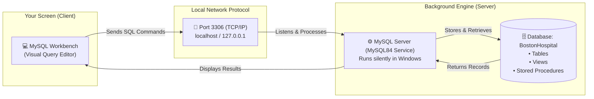
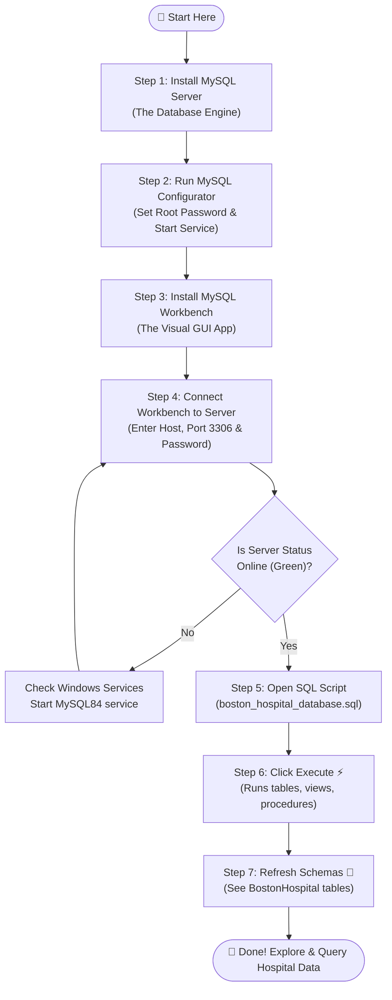
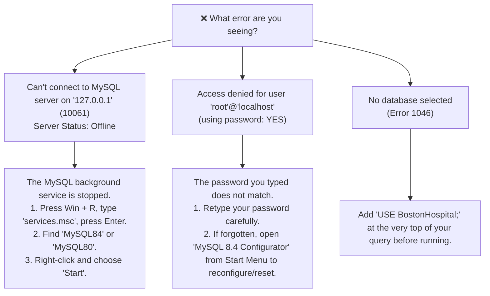

# Boston Hospital Database System — Beginner's Setup & Execution Guide

Welcome! If you have never worked with databases, MySQL, or SQL Workbench before, this guide is written specifically for you. It explains what each tool does in plain English and walks you through setting up and running the hospital database from absolute scratch.

---

## 1. The Big Picture: How MySQL Works

Before touching any buttons, here is the most common point of confusion:

> [!NOTE]
> **MySQL Workbench is NOT the database.**  
> * **MySQL Workbench** is just a visual dashboard (like a TV screen or remote control).
> * **MySQL Server** is the actual engine that stores and manages data (like the TV receiver / streaming box).
> 
> You need **both** for anything to work!

### Visual Architecture



---

## 2. End-to-End Workflow Diagram

Here is the exact journey from zero to seeing your hospital data on screen:



---

## 3. Step-by-Step Instructions

### Step 1: Install MySQL Server
If MySQL Server is not yet installed on the computer:

1. **Option A (Automatic via Terminal)**:
   Open Windows PowerShell and run:
   ```powershell
   winget install Oracle.MySQL
   ```
2. **Option B (Manual Download)**:
   - Visit the official [MySQL Community Downloads](https://dev.mysql.com/downloads/installer/).
   - Download the installer MSI file.
   - Run the installer and choose **Server only**.

---

### Step 2: Configure the Server & Set Your Password

Once installed, the server needs to be configured:

1. Click your **Windows Start Menu**.
2. Search for and open: **MySQL 8.4 Configurator** *(or approve the Windows UAC permission prompt)*.
3. Walk through the wizard steps:
   - **Type and Networking**: Keep default port `3306`. Click **Next**.
   - **Authentication Method**: Keep "Use Strong Password Encryption". Click **Next**.
   - **Accounts & Roles**:
     - Type a password for the `root` user (e.g. `admin123` or your personal password).
     - **Write this password down**; you will need it every time you log in!
     - Click **Next**.
   - **Windows Service**:
     - Ensure **"Configure MySQL Server as a Windows Service"** is checked.
     - Ensure **"Start the MySQL Server at System Startup"** is checked.
     - Service Name will typically be `MySQL84` or `MySQL80`.
     - Click **Next**.
   - **Apply Configuration**:
     - Click **Execute**.
     - Wait until all steps show green checkmarks, then click **Finish**.

> [!TIP]
> At this point, MySQL Server is running silently in the background as a Windows service!

---

### Step 3: Connect MySQL Workbench

1. Open **MySQL Workbench** from your Windows Start Menu.
2. On the home screen, you will see a connection card titled **`Local instance MySQL80`** or **`root@127.0.0.1:3306`**:
   - If not present, click the **`+`** icon next to *MySQL Connections* and fill in:
     - **Connection Name**: `Local Hospital DB`
     - **Hostname**: `127.0.0.1` (or `localhost`)
     - **Port**: `3306`
     - **Username**: `root`
3. Click **Test Connection**.
4. Enter the password you created in Step 2.
5. If you see *"Successfully made the MySQL connection"*, click **OK** and double-click the connection card to open the query editor.

---

### Step 4: Open and Run the Hospital SQL Script

1. In the top menu bar of MySQL Workbench, click:
   **File** ➔ **Open SQL Script...** *(or press `Ctrl + Shift + O`)*.
2. Browse to this project repository and select:
   `boston_hospital_database.sql`
3. The SQL script will open in a tab inside the Workbench editor.
4. Click the **Execute** button — this is the yellow lightning bolt icon (**⚡**) on the toolbar (or press `Ctrl + Shift + Enter`).
5. Look at the **Action Output** window at the bottom of the screen. You will see green checkmarks scrolling by as each table, constraint, view, procedure, and sample record is created.

---

### Step 5: Refresh Schemas and View Your Tables

1. Look at the left sidebar under the header **SCHEMAS**.
2. Click the small **Refresh icon (🔄)** located next to the word *SCHEMAS*.
3. You will see **`BostonHospital`** appear in the list!
4. Click the small arrow `>` next to `BostonHospital` to expand:
   - **Tables** (Contains `PATIENT`, `DOCTOR`, `APPOINTMENT`, `BILLING`, `PRESCRIPTION`, etc.)
   - **Views** (Contains analytical summaries like `vw_PatientBillingSummary`)
   - **Stored Procedures** (Contains transactional operations like `sp_RegisterNewPatient`, `sp_AdmitPatientToBed`)

```
SCHEMAS
└── 🗄️ BostonHospital
    ├── 📁 Tables
    │   ├── 📄 APPOINTMENT
    │   ├── 📄 BED
    │   ├── 📄 BILLING
    │   ├── 📄 DEPARTMENT
    │   ├── 📄 DOCTOR
    │   ├── 📄 INPATIENT_ADMISSION
    │   ├── 📄 MEDICAL_RECORD
    │   ├── 📄 NURSE
    │   ├── 📄 PATIENT
    │   ├── 📄 PRESCRIPTION
    │   ├── 📄 ROOM
    │   └── 📄 WARD
    ├── 📁 Views
    └── 📁 Stored Procedures
```

---

### Step 6: Test Queries (Copy & Paste)

Open a new SQL tab in Workbench by clicking the **SQL+** icon on the top left, paste the following, and click the lightning bolt (**⚡**):

```sql
-- 1. Switch to the Boston Hospital database
USE BostonHospital;

-- 2. Inspect registered patients
SELECT PatientID, FirstName, LastName, DateOfBirth, Gender, PhoneNumber, BloodType 
FROM PATIENT 
LIMIT 5;

-- 3. Check doctors and their departments
SELECT d.DoctorID, d.FirstName, d.LastName, d.Specialty, dept.DepartmentName
FROM DOCTOR d
JOIN DEPARTMENT dept ON d.DepartmentID = dept.DepartmentID;

-- 4. View active inpatient bed occupancy
SELECT * FROM vw_CurrentBedOccupancy;

-- 5. Test a stored procedure (Hospital Transaction)
-- Example: View complete billing summary for Patient #1
CALL sp_GeneratePatientBill(1);
```

---

## 4. Troubleshooting Guide ("Help! It didn't work!")



### Quick Reference of Common Issues

| Problem | Cause | How to Fix |
| :--- | :--- | :--- |
| **Server Status: Offline / Red badge** | MySQL Windows service is not running. | Press `Win + R`, type `services.msc`, locate `MySQL84`, right-click ➔ **Start**. |
| **Error 1045: Access denied for root** | Password mismatch. | Double-check password or rerun MySQL Configurator. |
| **Script execution takes long time** | Large script with extensive sample data. | This is normal; let it run for 10–20 seconds until green checks appear. |
| **Tables don't show up in left panel** | Workbench hasn't refreshed cached schemas. | Click the circular **Refresh icon (🔄)** next to the word *SCHEMAS* on the left. |

---

## 5. File Inventory

* **[`boston_hospital_database.sql`](./boston_hospital_database.sql)**: The complete SQL script that builds the database, tables, triggers, views, stored procedures, and sample records.
* **[`Boston_Hospital_Case_Study.md`](./Boston_Hospital_Case_Study.md)**: Academic technical report covering ERD design, Normalization (3NF/BCNF proofs), and stored procedure documentation.
* **[`SETUP_AND_RUN_GUIDE.md`](./SETUP_AND_RUN_GUIDE.md)**: This beginner-friendly step-by-step setup manual.
